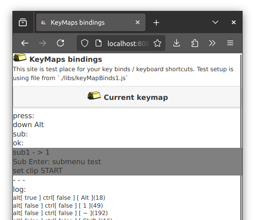
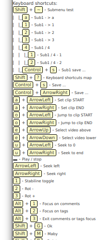

# Key Maps - binding / shortcuts

 Web site's it's not so bade place to make your UI. There is a load's of stuff what can help you make what you want from visual perspective. But how many times it's so difficult to make nice set of shortcuts on a webpage.
This is it. viteyss-site-keyMap is a library / site making / supporting exaction that.

## example

As a viteyss-site- it can be install as part of viteyss [[link...](https://github.com/yOyOeK1/viteyss)]

## use it as

Tool to enrich your site for key shortcuts support. It can build key map from definition for viewing cheat sheets, ...

### binds keys

By defining what key is bing with what key. For example for `dvorak` key layout keys `h t n s` are on right heand middle row. To bind it to arrows 
`arrowLeft ArrowTop ArrowBottom ArrowRight` simple array will do

```js
let keyBind = [ // on dvorak key layout
    'h', 'ArrowLeft',
    't', 'ArrowUp',
    'n', 'ArrowDown',
    's', 'ArrowRight'
];
```

### keyboard shortcuts

Simple definition of keyMap for creating shortcuts map.

```js
let keyMap1 = [
'Shift + ~', {name: 'submenu test', sub: submenu1},
'Shift + ?', 'keyboard shortcuts map',
'Control + s', 'save ...',
'Control + ArrowRight', 'save ...',
'a + ArrowLeft', 'set clip START',
'a + ArrowRight', 'set clip END',
'o + ArrowLeft', 'jump to clip START',
....
```

And yes it supports submenu so actions like:
[ Shift ] + [ \` ]  will enter `submenu test` then you can press .... 

Can be defined same way as main menu

```js
let submenu1 = [
    'a', 'sub1 - > a',
    '1', 'sub1 - > 1',
    '2', 'sub1 - > 2',
    '3', 'sub1 - > 3',
    '4', {name: 'sub1 / 4', sub:[
        '1','sub1 / 4 - 1',
        '2','sub1 / 4 - 2'
        ]},
    'Control + s', 'Sub1 save ...', // this not work

];
```

### xdoc

To use it in your project

```js
this.kmb = new vyKeyBinder( keyBind, keyMap1, 
   (onKeyShort)=>{
     console.log(`GotKeyShortcut\n`,onKeyShort);
   }, 
   true
   );
this.kmb.init();
```

#### screenshots



KeyMap in viteyss testing it ...




Generated map as cheat sheet for view. 


---

If you see that this makes sense [ send me a ☕ ](https://ko-fi.com/B0B0DFYGS) | [Master repository](https://github.com/yOyOeK1/oiyshTerminal) | [About SvOiysh](https://www.youtube.com/@svoiysh)
